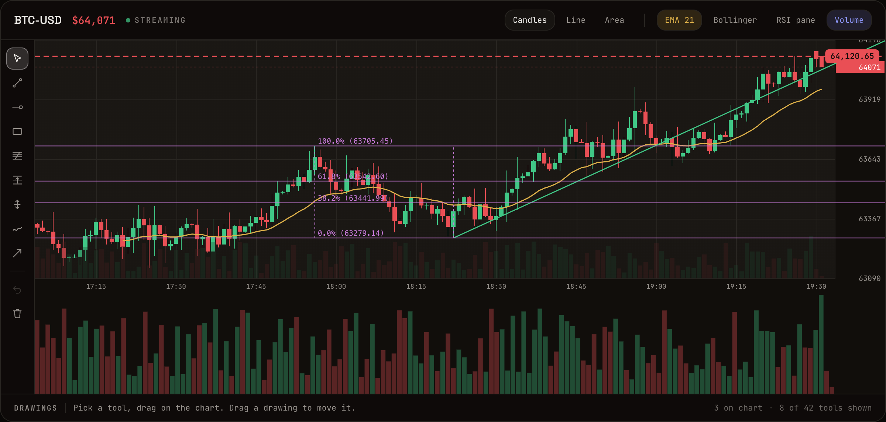

<div align="center">

# Fast Financial Charts

**A WebGL2 financial charting library for the web.** Candlesticks, 90 built-in indicators, 42 drawing tools, multi-pane layouts, live tick streaming, and an AI control surface. Free and MIT licensed.

[▶ Live demo](https://pairlens.finance/charts) · [API guide](docs/API.md) · [Indicators](INDICATORS.md) · [Changelog](CHANGELOG.md) · [Pairlens terminal](https://github.com/Pairlens/trading-terminal)

[](https://www.npmjs.com/package/@pairlens/fast-financial-charts)
[](https://www.npmjs.com/package/@pairlens/fast-financial-charts)
[](./LICENSE)

<a href="https://pairlens.finance/charts"></a>

<sub>The <a href="https://pairlens.finance/charts">live demo</a> is this exact package streaming ticks in your browser: chart types, indicators, and the full drawing toolkit.</sub>

</div>

`@pairlens/fast-financial-charts` is the chart engine behind the [Pairlens](https://github.com/Pairlens/trading-terminal) trading terminal. It is not a demo extracted from an app: the exact package published here renders live exchange feeds in production, every day, at tick rate. It was built to stand next to commercial charting SDKs and hold its own.

Reasons you might pick it over the alternatives:

- **You get a lot of chart.** [90 technical indicators](./INDICATORS.md) out of the box, sixteen chart types, 42 trader drawing tools with magnet snapping, price lines and buy/sell markers, multi-pane layouts with resizable separators, log/percent/indexed price scales, localization, and touch support. Most libraries make you build or buy half of this.
- **It is fast where it matters.** The main series renders as WebGL2 geometry, live ticks flow through an imperative O(1) hot path that bypasses React entirely, and indicators compute in a Web Worker off the main thread. Pan and zoom are single uniform updates on the GPU. It stays smooth with large histories and high-frequency feeds.
- **It is headless.** The engine owns the canvases and the hot path; your app owns every pixel of UI chrome (toolbars, HUDs, context menus, modals) through events and render slots. No CSS framework dependency, no styles to fight. It drops into ShadCN, Tailwind, or whatever your design system is.
- **An AI can drive it.** A deterministic, MCP-compatible schema exposes 52 tools (add indicators, draw, navigate, read data back, take screenshots), so an agent or your automation can operate the chart the same way a user does.
- **No licensing drama.** MIT, for real. No license tiers, no watermark, no attribution requirement, no "contact sales" features, no repo you can read but not ship. Fork it, extend it, sell with it.

## Installation

```bash
bun add @pairlens/fast-financial-charts
# or
pnpm add @pairlens/fast-financial-charts
# or
npm i @pairlens/fast-financial-charts
```

The package ships prebuilt ESM and CommonJS with type declarations beside both, so it needs no loader, transpiler, or bundler configuration. Every release is gated on a smoke test that packs the tarball, installs it into a clean project, and verifies all eleven subpaths import, require, bundle, and typecheck, alongside `publint --strict` and `are-the-types-wrong`. React is an optional peer dependency: the core engine never imports it, only the `/react` entry points do (React 19+). Details in the [API guide](docs/API.md#package-format).

## Quick start (React)

A candlestick chart with an EMA overlay and an RSI pane:

```tsx
import { useMemo, useRef } from 'react'
import { FastFinancialChart } from '@pairlens/fast-financial-charts/react'
import type {
  FastFinancialChartRef,
  ChartSeriesInput,
} from '@pairlens/fast-financial-charts/types'

export function PairChart() {
  const chartRef = useRef<FastFinancialChartRef>(null)

  const series = useMemo<ChartSeriesInput[]>(
    () => [
      {
        id: 'BTC-USD',
        label: 'BTC/USD',
        bars: [],
        color: '#22c55e',
        pricePrecision: 2, // decimal places shown on price axis and crosshair
      },
    ],
    [],
  )

  return (
    <FastFinancialChart
      ref={chartRef}
      series={series}
      timeframe="1m"
      defaultViewport={{ type: 'last-bars', bars: 200 }}
      indicators={[
        {
          type: 'EMA',
          seriesId: 'BTC-USD',
          params: { period: 21 },
          pane: 'overlay',
        },
        {
          type: 'RSI',
          seriesId: 'BTC-USD',
          params: { period: 14 },
          pane: 'separate',
        },
      ]}
    />
  )
}
```

Prefer no framework? The core engine (`@pairlens/fast-financial-charts`) has zero React imports and drives the same chart imperatively.

## Live tick streaming

Use ref methods for high-frequency updates to avoid React rerender churn. Same-bucket ticks mutate the last bar in place; the render path is a single GPU uniform update:

```tsx
chartRef.current?.applyTick({
  seriesId: 'BTC-USD',
  ts: Date.now(),
  price: 64020.5,
  volume: 0.12,
})

chartRef.current?.applyTicks(batchOfTicks) // burst ingestion for busy feeds

chartRef.current?.appendBar({
  seriesId: 'BTC-USD',
  bar: {
    ts: 1739990400000,
    open: 64000,
    high: 64100,
    low: 63980,
    close: 64020,
    volume: 42,
  },
})
```

## Let an AI drive it

The `/mcp` entry point exposes the whole chart as 52 deterministic, schema-validated tools. Wire it to an agent and it can add indicators, draw, navigate, read values back, and take screenshots, the same way a user does:

```ts
import { createChartMcpAdapter } from '@pairlens/fast-financial-charts/mcp'

const mcp = createChartMcpAdapter(chartRef.current)

await mcp.execute('addIndicator', {
  type: 'RSI',
  seriesId: 'BTC-USD',
  params: { period: 14 },
})
```

Agents can also subscribe to chart events (`indicatorComputeComplete`, `drawingsChange`, ...) for reactive workflows. Full tool list in the [API guide](docs/API.md#ai--mcp-integration).

## What's in the box

Everything below is configured through props on one component (or the equivalent imperative API). The [API guide](docs/API.md) covers each with code:

| Area                                                                     | Highlights                                                                                                            |
| ------------------------------------------------------------------------ | --------------------------------------------------------------------------------------------------------------------- |
| [Chart types](docs/API.md#chart-types)                                   | 16 GPU-accelerated types: candles, Heikin-Ashi, hollow, bars, line, area, baseline, Renko, Kagi, point & figure, more |
| [Indicators](INDICATORS.md)                                              | 90 built-ins across moving averages, oscillators, bands, trend, volume, volatility; computed in a Web Worker          |
| [Drawing tools](docs/API.md#built-in-drawing-tools)                      | 42 tools: trend lines, channels, Fibonacci, Gann, harmonic patterns, positions, measurement; all undoable             |
| [Multi-pane layouts](docs/API.md#multi-pane-management)                  | N panes with resizable separators and independent price scales                                                        |
| [Price & time scales](docs/API.md#price-scale-modes)                     | Normal, log, percentage, indexed-to-100; full time-scale and crosshair control                                        |
| [Multi-series compare](docs/API.md#multi-series-and-compare-modes)       | Indexed, price, and dual-axis comparison of multiple instruments                                                      |
| [Theming & localization](docs/API.md#theming)                            | Runtime partial theme overrides, light/dark presets, locale-aware axes and formatters                                 |
| [Headless composition](docs/API.md#headless-composition-shadcn-friendly) | Events and render slots for your own toolbars, HUDs, and context menus                                                |
| [Extensibility](docs/API.md#extensibility-indicators-and-drawings)       | Custom indicators, drawing shapes, series primitives, and custom series types                                         |
| [Depth chart](docs/API.md#tree-shakeable-entry-points)                   | `<DepthChart />` ships alongside the financial chart                                                                  |

Eleven tree-shakeable entry points (`/react`, `/mcp`, `/indicators`, `/drawings`, `/theme`, ...) share one module graph; a React candlestick chart with indicators lands well under the ~616 kB unminified full bundle. [Entry point list](docs/API.md#tree-shakeable-entry-points).

## Documentation

- [API guide](docs/API.md): every configuration surface, with code
- [Indicator reference](INDICATORS.md): all 90 indicators with parameters and pane types
- [Live demo](https://pairlens.finance/charts): the package running in your browser
- [Changelog](CHANGELOG.md)

## Development

From package root:

```bash
bun run typecheck        # tsc --noEmit over src
bun run test             # 274 unit + benchmark tests
bun run build            # emit dist/esm + dist/cjs into ./dist
bun run lint:package     # publint --strict + are-the-types-wrong
bun run smoke            # pack, install into a clean project, import/require/bundle/typecheck it
```

`build` runs `scripts/build.mjs`: `tsc` emits per-file ESM plus declarations into `dist/esm`, every relative specifier is rewritten to an explicit `./x.js` (the build fails if one cannot be resolved on disk), and the result is transpiled to `dist/cjs`. It also runs automatically on `prepack`, so `npm pack` and `npm publish` can never ship a stale or missing `dist`.

## Releasing (maintainers)

Releases are published to NPM by CI (`.github/workflows/publish.yml`) whenever a `v*` tag is pushed. The workflow re-runs typecheck, tests, the package lint and the consumer smoke test, verifies the tag matches `package.json`, and publishes with [provenance](https://docs.npmjs.com/generating-provenance-statements). It authenticates via [trusted publishing](https://docs.npmjs.com/trusted-publishers) (OIDC, no token secret): the trusted publisher is configured on the package's npm access page (GitHub org `Pairlens`, repo `@pairlens/fast-financial-charts`, workflow `publish.yml`).

```bash
npm version minor        # bumps package.json and creates the vX.Y.Z tag
git push origin main --follow-tags
```

## License

[MIT](./LICENSE). Free for commercial and non-commercial use, no tiers, no watermark. If it saves you a license fee, a star helps other builders find it.
